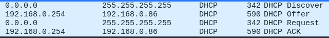

# Analyse de la Sécurité du Trafic Réseau avec Wireshark

## Informations Réseau
- **Adresse IP** : 192.168.0.86
- **Classe IP** : Classe C
- **Masque de sous-réseau** : 255.255.255.0
- **Adresse de la passerelle** : 192.168.0.254

## Questions et Réponses

### Quels sont les flags TCP ?
- **URG**: Urgent Pointer field significant
- **ACK**: Acknowledgment field significant
- **PSH**: Push Function
- **RST**: Reset the connection
- **SYN**: Synchronize sequence numbers
- **FIN**: No more data from sender

### Capturer le processus DORA du protocole DHCP

### Qu’est-ce que le DHCP Starvation / snooping ? Rogue DHCP ?
- **DHCP Starvation**: Attaque visant à épuiser les adresses IP disponibles en envoyant de multiples requêtes.
- **DHCP Snooping**: Technique de sécurité pour surveiller et filtrer les messages DHCP.
- **Rogue DHCP**: Un serveur DHCP non autorisé qui distribue des configurations réseau incorrectes.

### Que se passe lors du « ipconfig /release » (Windows) ? D’un point de vue sécurité, quel peut être l'enjeu ?
- **ipconfig /release** libère l'adresse IP actuelle. 
  - **Enjeu de sécurité** : possibilité de déni de service ou de réaffectation d'une adresse IP. Possibilité qu'un serveur DHCP rogue récupère le client.

### Quelle fonctionnalité propose CISCO pour se prémunir des attaques DHCP ?
- Cisco propose **DHCP Snooping** pour protéger contre les attaques DHCP.

### Capturer une requête DNS et sa réponse

### Qu’est-ce que le DNS Spoofing ? Comment s’en protéger ?
- **DNS Spoofing**: Manipulation des réponses DNS pour rediriger le trafic.
  - **Protection**: Utilisation de **DNSSEC** (Domain Name System Security Extensions).

### Qu’est-ce que DNSSEC ? DNS over TLS / HTTPS ?
- **DNSSEC**: Extensions de sécurité DNS pour assurer l'authenticité des réponses DNS.
- **DNS over TLS**: Chiffrement du trafic DNS via TLS.
- **DNS over HTTPS**: Chiffrement du trafic DNS via HTTPS.

### Dans quels cas trouve-t-on du DNS sur TCP ?
- Lors de la transmission de données volumineuses dépassant les 512 octets ou lorsque les réponses sont fragmentées.

### Capturer un flux HTTP

### Qu’est-ce que le HTTP Smuggling ? Donner un exemple de CVE
- **HTTP Smuggling**: Manipulation des requêtes HTTP pour contourner les contrôles de sécurité.
  - **Exemple de CVE**: CVE-2019-16278

### Comment mettre en place la confidentialité et l'authenticité pour HTTP ?
- Utilisation de **HTTPS** avec des certificats TLS.

### Qu’est-ce qu’une PKI ?
- **PKI (Public Key Infrastructure)** est un ensemble de procédures et technologies pour gérer les clés publiques et les certificats numériques.

### Capturer un mot de passe HTTP ou FTP ou Telnet (mettre en place les services si nécessaire)

### Comment mettre en place la confidentialité pour ce service ?
- Utilisation de protocoles sécurisés comme **HTTPS**, **FTPS**, ou **SSH** pour FTP et Telnet.

### Qu’est-ce qu’une autorité de certification (AC) racine ? Qu'est-ce qu'une AC intermédiaire ?
- Une **autorité de certification (AC) racine** est une AC dont le certificat est autosigné.
- Une **AC intermédiaire** est une AC dont le certificat est signé par une AC racine ou une autre AC intermédiaire.

### Connectez-vous sur https://taisen.fr et affichez la chaîne de confiance du certificat

### Capturer une authentification Kerberos (mettre en place le service si nécessaire)

### Capturer une authentification RDP (mettre en place le service si nécessaire)

### Quelles sont les attaques connues sur NetLM ?
- Les attaques connues sur NetLM incluent le **relay attack** et le **pass-the-hash attack**.

### Capturer une authentification WinRM (Vous pouvez utiliser EvilWinRM si nécessaire côté client.)

### Capturer une authentification SSH ou SFTP (mettre en place le service si nécessaire)

### Intercepter un fichier au travers du protocole SMB

### Comment protéger l'authenticité et la confidentialité d'un partage SMB ?
- Utilisation de **SMB3** avec chiffrement activé et configuration de l'authentification par **Kerberos**.
